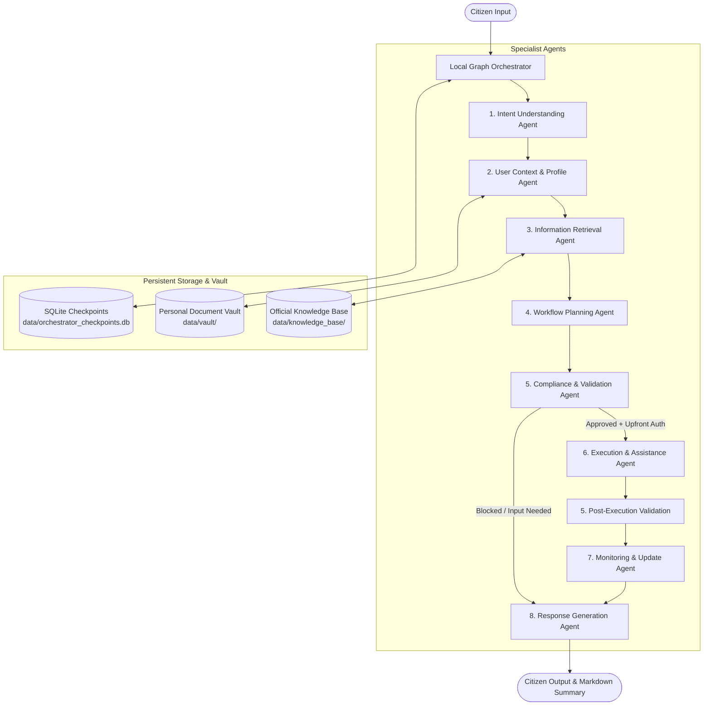

# Personal Bureaucracy Assistant (Local Multi-Agent Prototype)

Local-first Python terminal assistant with a unified **Local Multi-Agent Orchestrator** managing state, execution graph transitions, and contract reconciliation across all eight specialist agents:

1. **Intent Understanding Agent** — classifies a citizen goal into a validated `IntentResult`.
2. **User Context & Profile Agent** — reads only an authorized vault and local profile, returning a validated `ProfileContextResult`.
3. **Information Retrieval Agent** — fetches allowlisted official Passport Seva / MEA pages and returns a validated `RetrievedEvidenceResult`.
4. **Workflow Planning Agent** — turns evidence and profile context into a validated `WorkflowPlan` (steps, dependencies, gaps, approvals).
5. **Compliance & Validation Agent** — deterministically validates the plan, contracts, evidence provenance, fact confirmation, dependencies, and approval checkpoints (`ValidationResult`).
6. **Execution & Assistance Agent** — performs human-gated, visible Playwright browser automation for Indian Passport Seva registration (`ExecutionResult`).
7. **Monitoring & Update Agent** — tracks local workflow status transitions, records timestamped events with explicit provenance, detects deltas, and manages CLI reminders (`MonitoringResult`).
8. **Response Generation Agent** — turns structured workflow outputs into clear, grounded citizen responses and Markdown summaries (`CitizenResponse`).

---

## 🚀 Quick Start: Local Orchestrator CLI

```bash
# 1. Run static contract & schema audit across all 8 specialist agents
python3 -m src.bureaucracy_agent.orchestrator.cli contracts-check

# 2. Run end-to-end dry-run orchestration pass (demo mode)
python3 -m src.bureaucracy_agent.orchestrator.cli run --demo --dry-run

# 3. Run interactive workflow with upfront authorization phrase
python3 -m src.bureaucracy_agent.orchestrator.cli run --goal "Passport Seva online registration" --auth "AUTHORIZE PASSPORT SEVA REGISTRATION AND SUBMISSION"

# 4. Inspect saved SQLite checkpoint status
python3 -m src.bureaucracy_agent.orchestrator.cli status

# 5. Resume a paused workflow by ID
python3 -m src.bureaucracy_agent.orchestrator.cli resume --workflow-id <WORKFLOW_ID>
```

---

## 🏛️ End-to-End Orchestrator Architecture



---

# Intent Understanding Agent

The first agent turns a citizen’s natural-language goal (plus optional caller-supplied context) into a validated `IntentResult` that later agents can consume unchanged.

This agent does not search the web, read a profile vault, plan workflow steps, drive a browser, or talk to other agents. Vault access belongs to the User Context & Profile Agent below.

## Purpose

Given a user goal such as registering on Passport Seva, classify:

- likely service and document type
- task type (`register`, `apply`, `renew`, `reissue`, `update`, `track`, `understand_requirements`, `other`, `unknown`)
- explicitly stated facts, entities, jurisdiction, language, and urgency
- ambiguities, assumptions, and clarification questions
- confidence and routing status (`ready`, `needs_clarification`, `unable_to_classify`)

The first demo service is Indian Passport Seva new-user registration. The contract is service-agnostic so Aadhaar, certificates, driving licence, and voter requests can use the same schema.

## Non-goals

Not in this agent:

- Profile/vault scanning or filesystem reads (see User Context & Profile Agent)
- Web search, RAG, embeddings, Chroma, or official-source retrieval
- Workflow planning or task graphs
- Browser automation or Passport Seva navigation
- Form filling, payments, or registration submission
- An orchestrator that chains every agent automatically
- Cloud model providers or paid APIs
- Default persistence of user goals or conversation history

Context and document snippets are **only** what the caller puts on `IntentRequest`. Missing values are never inferred from the OS, IP, or sample files.

## Model choice

| Setting | Value |
|---|---|
| Default model | `qwen3:1.7b` |
| Runtime | Local [Ollama](https://ollama.com) |
| API key | **None required** |

This agent only does short classification and entity extraction. It does not need tool calling, OCR, long-document analysis, or multi-step planning. A small open-weight chat model on Ollama fits that job and is intended to run on 8 GB RAM machines. Later agents may choose different models; the adapter in `llm.py` is replaceable and is not a shared “one model for the whole system” layer.

If Ollama or the model is unavailable, the CLI still returns a validated `IntentResult` from a **deterministic fallback**. That path is labeled `deterministic fallback` and is never described as an LLM run.

## Public callable

Synchronous (Ollama is called over HTTP with `httpx`):

```python
from agents.intent_understanding import IntentRequest, understand_intent

result = understand_intent(
    IntentRequest(user_goal="I need to register on Passport Seva for a new passport.")
)
```

`understand_intent(request: IntentRequest) -> IntentResult` is the stable API. Every model response is parsed, then validated with Pydantic before return. `contract_version` and `request_id` on the result always match the request. `original_goal` is the caller’s goal, not a model rewrite.

## Input: `IntentRequest`

| Field | Required | Notes |
|---|---|---|
| `contract_version` | no (default `1.0`) | Contract identifier |
| `request_id` | no (generated UUID) | Caller ID reused on follow-ups |
| `user_goal` | **yes** | Natural-language request |
| `language_preference` | no | User-stated language |
| `jurisdiction_hint` | no | Location only if the user/profile supplied it |
| `user_context` | no (default `""`) | Concise authorized profile summary from the caller |
| `document_context` | no (default `[]`) | Short extracted snippets/metadata from the caller |
| `conversation_context` | no (default `""`) | Prior-turn text for follow-ups |

`user_context`, `document_context`, and `conversation_context` are untrusted source data. Embedded instructions in those fields are ignored.

## Output: `IntentResult`

Canonical handoff object. Later agents must not reverse-engineer terminal prose or raw model text.

| Field | Notes |
|---|---|
| `contract_version` | `1.0`, echoed from the request |
| `request_id` | Same as the request |
| `original_goal` | Preserved user goal |
| `normalized_goal` | Concise restatement **without added facts** |
| `service_name` | Likely service, or `null` |
| `document_type` | Likely document/certificate, or `null` |
| `task_type` | Enum listed above |
| `jurisdiction` | Only if explicitly present in the request or supplied context; else `null` |
| `entities` | `{type, value, source}` where `source` is `user_goal` / `user_context` / `document_context` / `conversation_context` |
| `stated_facts` | Explicit facts with source |
| `assumptions` | Unconfirmed interpretations |
| `ambiguities` | Unresolved items |
| `clarification_questions` | Asked only when needed to identify task or service |
| `language` | Stated preference, otherwise `English` |
| `urgency` | Explicit urgency or `null` (not inferred from unrelated wording) |
| `complexity` | `low`, `medium`, `high`, `unknown` |
| `confidence` | `0` to `1` |
| `status` | `ready`, `needs_clarification`, `unable_to_classify` |

JSON Schema is generated from the Pydantic model at `contracts/intent_result.schema.json`. Do not hand-edit it out of sync with `schema.py`.

## Downstream handoff (future agents)

The serialized `IntentResult` is what the next component receives. A future orchestrator will connect these paths. Those agents are **not** implemented here.

| Receiving component (future work) | Input it receives from this agent | Fields it should use | Expected output (defined later) |
|---|---|---|---|
| User Context & Profile Agent | Complete serialized `IntentResult`, plus its own authorized profile/vault access | `service_name`, `document_type`, `task_type`, `jurisdiction`, `entities`, `stated_facts`, `language` | `ProfileContextResult`: relevant facts/documents with provenance, missing facts, conflicts; it must not promote `assumptions` to confirmed facts |
| Information Retrieval Agent | Complete `IntentResult` plus `ProfileContextResult` from the profile agent | `service_name`, `document_type`, `task_type`, `jurisdiction`, `normalized_goal`, `language` | `RetrievedEvidenceResult`: official requirements/procedure with URLs, excerpts, retrieval timestamps, and uncertainty |
| Workflow Planning Agent | `IntentResult` + `ProfileContextResult` + `RetrievedEvidenceResult` | All fields, especially ambiguities/questions, confirmed context, and evidence | `WorkflowPlan`: ordered steps, dependencies, prerequisites, risks, approvals, missing inputs |
| Execution & Assistance Agent | Later validated plan and approved step; not this agent’s raw output alone | Stable `request_id`, selected service/task, approved context | `ExecutionResult`: observed actions/status, human pause points, no unapproved submission |
| Compliance & Validation Agent | Relevant intent + profile/evidence/plan/execution records | Task scope, jurisdictions, sources, facts, requested action | `ValidationResult`: approve, needs user input, or block, with reasons |
| Monitoring & Update Agent | Workflow state and execution/portal observations | `request_id`, service, task, state transitions | `MonitoringResult`: timestamped observed status and next event |
| Response Generation Agent | Structured final status and relevant upstream outputs | User’s language, status, evidence, pending actions, confirmation if verified | `CitizenResponse`: plain-language summary and next action |

### Sample payload the next agent receives

This is a complete `IntentResult` JSON object (fictional demo data only):

```json
{
  "contract_version": "1.0",
  "request_id": "demo-passport-register-001",
  "original_goal": "I am a first-time applicant and need to register on Passport Seva to apply for a new ordinary passport in Tamil Nadu.",
  "normalized_goal": "I am a first-time applicant and need to register on Passport Seva to apply for a new ordinary passport in Tamil Nadu.",
  "service_name": "Passport Seva",
  "document_type": "Passport",
  "task_type": "register",
  "jurisdiction": "Tamil Nadu",
  "entities": [
    {"type": "service", "value": "passport", "source": "user_goal"},
    {"type": "document", "value": "Passport", "source": "user_goal"},
    {"type": "location", "value": "Tamil Nadu", "source": "user_goal"}
  ],
  "stated_facts": [
    {"text": "User mentioned passport.", "source": "user_goal"},
    {"text": "Tamil Nadu", "source": "user_goal"}
  ],
  "assumptions": [],
  "ambiguities": [],
  "clarification_questions": [],
  "language": "English",
  "urgency": null,
  "complexity": "medium",
  "confidence": 0.74,
  "status": "ready"
}
```

Ambiguous example: `"I need to update my document."` should come back as `needs_clarification` with questions, not a guessed service.

## File layout

```text
intent-understanding-agent/
  README.md
  requirements.txt
  .env.example
  .gitignore
  contracts/
    intent_result.schema.json
    profile_context_result.schema.json
    retrieved_evidence_result.schema.json
    workflow_plan.schema.json
  data/
    vault/                    # only user-authorized files
    profile.example.json      # synthetic example; not a live profile unless --demo
    retrieval_cache/          # local official-source chunk cache (gitignored)
    plans/                    # optional saved WorkflowPlan JSON (gitignored)
  agents/
    __init__.py
    intent_understanding/
      ...
    user_context/
      ...
    information_retrieval/
      __init__.py
      agent.py
      prompt.py
      schema.py
      sources.py              # allowlist, fetch, parse
      index.py                # simple JSONL chunk cache, optional embeddings
      llm.py
      config.py
      cli.py
    workflow_planning/
      __init__.py
      agent.py
      prompt.py
      schema.py
      validator.py            # IDs, evidence citations, DAG, approval gates
      llm.py
      config.py
      cli.py
      __main__.py
```

## Setup

No API key is required. `.env.example` contains local Ollama URLs/models, vault/profile paths, and timeouts only. **Do not put passwords, OTPs, CAPTCHA values, recovery codes, or payment data in the vault or `.env`.**

### macOS

```bash
cd intent-understanding-agent
python3 -m venv .venv
source .venv/bin/activate
pip install -r requirements.txt
cp .env.example .env
```

Install Ollama from https://ollama.com, then:

```bash
ollama serve
ollama pull qwen3:1.7b
ollama pull qwen3:4b-instruct
ollama pull qwen3-embedding:0.6b
```

In a second terminal:

```bash
cd intent-understanding-agent
source .venv/bin/activate
python -m agents.intent_understanding
```

### Windows (PowerShell)

```powershell
cd intent-understanding-agent
python -m venv .venv
.\.venv\Scripts\Activate.ps1
pip install -r requirements.txt
copy .env.example .env
```

Install Ollama, then:

```powershell
ollama serve
ollama pull qwen3:1.7b
ollama pull qwen3:4b-instruct
ollama pull qwen3-embedding:0.6b
python -m agents.intent_understanding
```

### Run the demo with an example goal

```bash
python -m agents.intent_understanding --goal "I am a first-time applicant and need to register on Passport Seva to apply for a new ordinary passport in Tamil Nadu." --json
```

Ambiguous request:

```bash
python -m agents.intent_understanding --goal "I need to update my document." --json
```

Force the labeled fallback (no LLM):

```bash
python -m agents.intent_understanding --goal "I need to update my document." --fallback-only --no-follow-up
```

Write JSON only if you explicitly choose a path (the raw goal is not saved otherwise):

```bash
python -m agents.intent_understanding --goal "I need to register on Passport Seva." --save-json intent.json --no-follow-up
```

The CLI never asks for passwords, OTPs, CAPTCHA values, or payment credentials. After a result, you can type a follow-up; the next call reuses `request_id` and passes a short `conversation_context`.

### Regenerate the JSON Schema

```bash
python -m agents.intent_understanding.schema
# equivalent:
python -c "from agents.intent_understanding.schema import write_intent_result_schema; print(write_intent_result_schema())"
```

Inspect `contracts/intent_result.schema.json`. It must match `IntentResult` in `schema.py`.

## Fallback and common Ollama errors

| Situation | What happens |
|---|---|
| Ollama not installed / `ollama serve` not running | Connection error. CLI uses **deterministic fallback** and prints that an LLM was not used. |
| Model not pulled | Error mentions `ollama pull qwen3:1.7b`. Fallback runs. |
| Empty or invalid model JSON | Parsed output is rejected by Pydantic. Fallback runs. |
| Timeout | Increase `OLLAMA_TIMEOUT_SECONDS` in `.env`. Fallback runs if the request fails. |

Install notes:

- macOS: `brew install ollama` or the official installer, then `ollama serve`
- Windows: official installer, confirm `ollama` is on `PATH`

Default URL is `http://127.0.0.1:11434`. Override with `OLLAMA_URL` if Ollama listens elsewhere.

Optional: after intent classification, run the profile agent without changing the `IntentResult` contract:

```bash
python -m agents.intent_understanding --goal "I need to register on Passport Seva in Tamil Nadu." --with-profile --no-follow-up --json
```

---

# User Context & Profile Agent

Second specialist agent. It receives the **complete** `IntentResult` plus explicitly configured vault/profile paths and returns one `ProfileContextResult` JSON object for Information Retrieval and Workflow Planning.

## Responsibility

- Read only the configured `vault_dir` and `profile_path`.
- Parse labeled `key: value` text (and text-based PDFs via `pypdf` when possible).
- Optionally ask a local instruction-following model to interpret leftover unstructured text.
- Return relevant candidate facts with provenance, conflicts, missing requested keys, and file-scan metadata.
- Interview in the terminal only for requested keys or real conflicts, then persist **only** user-confirmed facts after explicit save consent.

## Non-goals

- Scanning the home directory, email, cloud storage, browser profiles, or the network
- Official government-rule retrieval or eligibility decisions (later Information Retrieval / Planning)
- OCR for scanned PDFs
- Embeddings, vector databases, cloud models, or paid APIs
- Auto-promoting document-extracted or inferred facts to `user_confirmed`
- Treating file presence as proof a document is current or accepted by government
- Orchestration, browser automation, or Passport Seva submission

## Model choice for this task

Document mapping needs more language capacity than the Intent Agent’s short classifier, but consent, path safety, and persistence must stay in Python.

| Setting | Value |
|---|---|
| Default profile model | `qwen3:4b-instruct` via local Ollama (~2.5 GB download; that is **not** total RAM use) |
| Smaller fallback | `PROFILE_FALLBACK_MODEL=qwen3:1.7b` |
| Context | `PROFILE_NUM_CTX` default 8192 |
| API key | **None required** |

Do not load the Intent model and the Profile model at the same time. Actual memory use depends on context and the machine; this README does not promise 8 GB performance. If Ollama cannot run, labeled extraction still works and is labeled `deterministic` or `mixed`. The CLI never claims an LLM extracted facts when it did not.

Set `PROFILE_MODEL` independently of `OLLAMA_MODEL`. Later agents may choose yet another runtime.

## Public callable

```python
from agents.intent_understanding.schema import IntentResult
from agents.user_context import ProfileContextRequest, build_user_context

result = build_user_context(
    ProfileContextRequest(
        request_id=intent.request_id,
        intent=intent,  # complete IntentResult, not a paraphrase
        vault_dir="data/vault",
        profile_path="data/profile.json",
        requested_fact_keys=["full_name"],  # optional; empty means do not invent a required-field list
        allow_model_extraction=True,
        save_confirmed_facts=False,
    )
)
```

Synchronous signature: `def build_user_context(request: ProfileContextRequest) -> ProfileContextResult`.

Authorized paths come from the application/CLI. Paths mentioned inside documents are ignored. Every opened vault file is resolved and rejected if it leaves `vault_dir`.

## Input: `ProfileContextRequest`

| Field | Notes |
|---|---|
| `contract_version` | Default `1.0` |
| `request_id` | Same ID as the originating intent request |
| `intent` | Complete validated `IntentResult` |
| `vault_dir` | Directory the user authorizes |
| `profile_path` | Local profile JSON path |
| `requested_fact_keys` | Optional exact keys a later stage needs; default empty |
| `user_preferences` | Optional consented non-secret preferences |
| `allow_model_extraction` | Default true |
| `save_confirmed_facts` | Default false; never silently persist extracted facts |

## Output: `ProfileContextResult`

JSON Schema is generated from the Pydantic model at `contracts/profile_context_result.schema.json`.

| Field | Notes |
|---|---|
| `contract_version` | `1.0` |
| `request_id` / `intent_request_id` | Correlation IDs |
| `service_name` / `task_type` / `jurisdiction` | Copied from intent; jurisdiction is not inferred |
| `profile_status` | `ready`, `needs_user_input`, `conflicts_found`, `no_relevant_context`, `partial`, `failed` |
| `relevant_facts` | `ProfileFact` list (not whole documents) |
| `missing_requested_facts` | Only keys from `requested_fact_keys` that are not found **and confirmed** |
| `conflicts` | Disagreements plus source refs |
| `questions_for_user` | Terminal questions for missing requested values or conflicts |
| `scanned_files` | Metadata/status only |
| `consent_updates` | Which keys were save / use once / skip; no secret values |
| `profile_updated` | Whether `data/profile.json` changed |
| `processing_mode` | `deterministic`, `ollama`, or `mixed` |
| `warnings` | Unsupported files, parse limits, model/runtime issues |

Each `ProfileFact` has `key`, `value`, `status` (`user_confirmed`, `document_extracted`, `inferred`, `unknown`), `source_type` (`user`, `profile`, `document`, `derived`), `source_ref` (relative path or `profile:key`, never an absolute path), `extracted_at`, `confidence`, `relevant_to`, `sensitivity`, and `confirmed_by_user`.

Document-extracted and inferred facts stay unconfirmed until the user says so.

### Sample `ProfileContextResult` for Information Retrieval

Fictional demo values:

```json
{
  "contract_version": "1.0",
  "request_id": "demo-passport-register-001",
  "intent_request_id": "demo-passport-register-001",
  "service_name": "Passport Seva",
  "task_type": "register",
  "jurisdiction": "Tamil Nadu",
  "profile_status": "partial",
  "relevant_facts": [
    {
      "key": "full_name",
      "value": "Priya Nair",
      "status": "user_confirmed",
      "source_type": "profile",
      "source_ref": "profile:full_name",
      "extracted_at": "2026-01-01T00:00:00+00:00",
      "confidence": 1.0,
      "relevant_to": "May be relevant to register for Passport Seva; not a verified government requirement.",
      "sensitivity": "ordinary",
      "confirmed_by_user": true
    },
    {
      "key": "date_of_birth",
      "value": "1994-03-12",
      "status": "document_extracted",
      "source_type": "document",
      "source_ref": "notes.txt",
      "extracted_at": "2026-09-23T16:00:00+00:00",
      "confidence": 0.72,
      "relevant_to": "May be relevant to register for Passport Seva; not a verified government requirement.",
      "sensitivity": "personal",
      "confirmed_by_user": false
    }
  ],
  "missing_requested_facts": [],
  "conflicts": [],
  "questions_for_user": [],
  "scanned_files": [
    {"relative_path": "notes.txt", "status": "read", "media_type": "text", "character_count": 400, "warning": null}
  ],
  "consent_updates": [],
  "profile_updated": false,
  "processing_mode": "deterministic",
  "warnings": []
}
```

Information Retrieval must consume this object together with the original `IntentResult`. It should personalize only with confirmed context and must not treat profile data as official rules. Workflow Planning must not treat `document_extracted` / `inferred` as confirmed.

## Vault contents and demo data

Put only authorized `.txt`, `.md`, or text-based `.pdf` files in `data/vault/`. `notes.txt` is synthetic. `data/profile.example.json` is fictional and is loaded only with `--demo`. Live facts persist in `data/profile.json` after consent (gitignored).

## Terminal interview and consent

When `requested_fact_keys` are missing or sources conflict:

1. The CLI explains the gap. It does **not** claim an official Passport Seva requirement.
2. It asks only for those missing requested keys or conflict resolutions — not every possible form field.
3. For a proposed non-secret update it offers **save**, **use once**, or **skip**.
4. Save writes structured facts to `data/profile.json` (atomic replace). Raw documents and transcripts are not stored.
5. Use once keeps the value on this `ProfileContextResult` only.
6. Highly sensitive identifiers are masked in the terminal. Secrets are refused.

## Run the profile agent

```bash
# synthetic IntentResult + sample vault (no live profile unless you save)
python -m agents.user_context --demo --no-model --no-interview --json

# ask only for an explicitly requested key
python -m agents.user_context --demo --requested-fact date_of_birth

# use a real IntentResult file from the first agent
python -m agents.user_context --intent-json intent.json --vault-dir data/vault --profile-path data/profile.json --json --no-interview
```

### macOS / Windows notes

`pypdf` is installed from `requirements.txt`. If a PDF has no extractable text, the scan status is `unreadable` (no OCR). Pull `qwen3:4b-instruct` for unstructured extraction, or set `PROFILE_MODEL=qwen3:1.7b`, or pass `--no-model`.

### Review / delete / erase

```bash
python -m agents.user_context profile list
python -m agents.user_context profile delete --key full_name
python -m agents.user_context profile erase --yes
```

### Regenerate the profile JSON Schema

```bash
python -m agents.user_context.schema
```

Do not hand-edit `contracts/intent_result.schema.json`. The Intent Agent contract is unchanged.

## Downstream handoffs (future; not implemented here)

| Future receiver | Exact inputs | How it should use them | Later output |
|---|---|---|---|
| Information Retrieval Agent | Complete `IntentResult` + complete `ProfileContextResult` | Search official sources from intent service/task/jurisdiction. Use only relevant confirmed context for personalization. Profile data is not proof of government rules. | `RetrievedEvidenceResult` |
| Workflow Planning Agent | `IntentResult` + `ProfileContextResult` + `RetrievedEvidenceResult` | Combine intent, confirmed context, official evidence, missing requested facts, unresolved conflicts. Never treat `document_extracted`/`inferred` as confirmed. | `WorkflowPlan` |
| Compliance & Validation Agent | Relevant intent/profile/evidence/plan/execution records | Provenance, conflicts, completeness, consent | `ValidationResult` |
| Execution & Assistance Agent | Approved plan steps and user-confirmed facts only | Visible user approval; never read secrets | `ExecutionResult` |
| Response Generation Agent | Structured upstream outputs | Citizen-friendly progress without leaking sensitive profile values | `CitizenResponse` |

A future orchestrator will pass these serialized objects. It is not built in this step.

---

# Information Retrieval Agent

Third specialist agent. It receives the complete `IntentResult` and complete `ProfileContextResult`, fetches **allowlisted official** Passport Seva / Ministry of External Affairs pages, and returns one `RetrievedEvidenceResult` for Workflow Planning.

## Responsibility

- Build generic search queries from intent service/task/jurisdiction (no personal document values).
- Fetch HTTPS pages/PDFs only from the configured hostname allowlist, validating redirects.
- Parse HTML (`BeautifulSoup`) and text-based PDFs (`pypdf`). No OCR.
- Rank passages with keyword overlap, optionally `qwen3-embedding:0.6b`.
- Optionally ask `qwen3:1.7b` to extract claims **only** from those excerpts.
- Cite every `RequirementCandidate` with `evidence_ids` from this run.

## Non-goals

- Web search APIs, unofficial blogs, or model-memory “rules”
- Using the user’s vault documents as evidence of government requirements
- Login, CAPTCHA, form submission, scraping evasion, or browser automation
- Expanding the allowlist from links inside user files
- OCR, full-portal crawls, Chroma from the reference project, orchestration, or planning

## Where it sits

`Intent Understanding → User Context & Profile → Information Retrieval → **Workflow Planning** → (future) Compliance / Execution / Monitoring / Response`

Inputs: complete `IntentResult` + complete `ProfileContextResult`.  
Output: complete `RetrievedEvidenceResult`. Planning must consume these three objects, not CLI prose.

## Model/tool choice by subtask

| Subtask | Tool | Why |
|---|---|---|
| Fetch/parse | `httpx` + BeautifulSoup + `pypdf` | Official pages/PDFs are structured enough; no cloud API |
| Semantic matching (optional) | Ollama `qwen3-embedding:0.6b` (~639 MB download, not total RAM) | Local vectors over cached official chunks |
| Claim extraction (optional) | Ollama `qwen3:1.7b`, source-grounded JSON | Must not invent rules; Pydantic-validated |
| Fallback | Deterministic keyword ranking + sentence extraction | Labeled when embeddings/LLM are skipped |

Embeddings and generation are used **sequentially**, not loaded together on purpose. Download size is not a memory guarantee. No API key.

Index choice: a **simple JSONL chunk cache** under `data/retrieval_cache/` (gitignored) with URL, host, retrieved_at, and content hash on every chunk. This avoids a stale Chroma collection from the reference project and keeps provenance explicit.

## Public callable

```python
from agents.information_retrieval import (
    InformationRetrievalRequest,
    retrieve_information,
)

result = retrieve_information(
    InformationRetrievalRequest(
        intent=intent_result,                 # Agent 1
        profile_context=profile_context_result,  # Agent 2
        use_semantic_search=True,
        language=intent_result.language,
    )
)
```

`def retrieve_information(request: InformationRetrievalRequest) -> RetrievedEvidenceResult`

`intent.request_id` must match `profile_context.intent_request_id` or the result is `failed`.

Workflow Planning consumes this object together with the original intent and profile results:

```python
from agents.workflow_planning import WorkflowPlanningRequest, create_workflow_plan

plan = create_workflow_plan(
    WorkflowPlanningRequest(
        intent=intent_result,
        profile_context=profile_context_result,
        retrieved_evidence=result,
    )
)
```

## Allowlist (defaults)

- `passportindia.gov.in`, `www.passportindia.gov.in`, `portal2.passportindia.gov.in`
- `mea.gov.in`, `www.mea.gov.in`

Start URLs are the configured official registry (portal, registration, steps PDF, fresh-document advisor, application FAQ, MEA passport page). Discovery follows a few same-host official links whose labels mention register/document/apply. HTTPS only. Timeouts, size caps, and an identifying User-Agent are set. Blocked/login pages are recorded as `blocked` / warnings, not invented.

Refresh the local cache by deleting `data/retrieval_cache/` and re-running retrieval.

## Output: `RetrievedEvidenceResult`

Generated schema: `contracts/retrieved_evidence_result.schema.json`.

Every requirement has `evidence_ids`. Statements without evidence are dropped. Jurisdiction is copied from intent, never inferred. User documents are not sources of rules.

### Sample payload Workflow Planning will receive

(Illustrative; live excerpts and timestamps come from the official fetch.)

```json
{
  "contract_version": "1.0",
  "request_id": "demo-retrieval-001",
  "intent_request_id": "demo-passport-register-001",
  "profile_context_request_id": "demo-passport-register-001",
  "service_name": "Passport Seva",
  "task_type": "register",
  "jurisdiction": "Tamil Nadu",
  "retrieval_status": "partial",
  "search_queries": [
    {
      "query": "Passport Seva official register procedure",
      "basis": "intent.service_name and intent.task_type"
    }
  ],
  "evidence": [
    {
      "evidence_id": "ev-001",
      "source_title": "Steps to apply for passport services",
      "source_url": "https://www.passportindia.gov.in/AppOnlineProject/pdf/steps_to_apply_for_passport_services.pdf",
      "source_host": "www.passportindia.gov.in",
      "source_type": "official_pdf",
      "retrieved_at": "2026-09-23T16:50:00+00:00",
      "published_or_updated_at": null,
      "section_heading": "Steps to Apply for Passport Services",
      "excerpt": "Register yourself as new user by creating User Id. Provide User Id details and click Register. E-mail Id is mandatory…",
      "content_hash": "abc123",
      "relevance_score": 0.62,
      "supports": ["req-001"]
    }
  ],
  "requirements_found": [
    {
      "requirement_id": "req-001",
      "statement": "Register yourself as new user by creating User Id. E-mail Id is mandatory.",
      "evidence_ids": ["ev-001"],
      "jurisdiction_scope": "unknown",
      "source_status": "official_date_unclear",
      "confidence": 0.6
    }
  ],
  "unanswered_questions": [],
  "sources_checked": [],
  "warnings": ["One or more official sources did not expose a clear publication/update date."],
  "processing_mode": "deterministic"
}
```

## Handoff

| Receiver | Exact payload | Use | Later output |
|---|---|---|---|
| Workflow Planning Agent (implemented) | `IntentResult` + `ProfileContextResult` + `RetrievedEvidenceResult` | Personalized steps from the goal, **user-confirmed** profile facts, and cited official evidence. Treat requirements as candidates; keep missing facts and source warnings. | `WorkflowPlan` |
| Compliance & Validation Agent (future) | Those three plus the `WorkflowPlan` | Re-check claims against evidence IDs and confirmed facts | `ValidationResult` |
| Response Generation Agent (future) | Structured workflow/evidence/validation/execution | Status and next steps with official links | `CitizenResponse` |

## Run

```bash
python -m agents.information_retrieval --demo --no-semantic --no-llm --json
python -m agents.information_retrieval --intent-json intent.json --profile-json profile.json --json
python -m agents.information_retrieval.schema
```

`--demo` labels synthetic contracts and does **not** put vault personal facts into queries.

### macOS / Windows

Same venv as the other agents. `beautifulsoup4` and `pypdf` come from `requirements.txt`. Optional:

```bash
ollama pull qwen3-embedding:0.6b
ollama pull qwen3:1.7b
```

If Ollama is down, the CLI still fetches official pages and extracts deterministically. It will say embeddings/LLM were not used.

## Limitations

- Official sites may block non-browser clients; that is recorded, not bypassed.
- Publication dates are often missing (`official_date_unclear`).
- Registration pages can be application forms; this agent never submits them.
- Cache is local and must be refreshed to pick up portal changes.

---

# Workflow Planning Agent

Fourth specialist agent. It receives the complete `IntentResult`, `ProfileContextResult`, and `RetrievedEvidenceResult`, then returns one validated `WorkflowPlan` for later Compliance, Execution, Monitoring, and Response agents.

It decides **which steps and prerequisites belong in a plan**. It does not perform the steps, search the web, scan the vault, update a profile, fill a form, pay, book an appointment, or contact government.

## Responsibility

- Use the user’s stated service, task type, jurisdiction, language, and goal from `IntentResult` (copied, not re-inferred).
- Treat only `user_confirmed` profile facts as satisfied prerequisites. `document_extracted`, `inferred`, and `unknown` facts stay unconfirmed.
- Use `RetrievedEvidenceResult` as the **only** source of official requirements, procedures, fees, deadlines, or eligibility. Every such claim on a step must cite `evidence_ids` that exist in that exact result.
- Preserve retrieval warnings, conflicting official sources, jurisdiction uncertainty, intent clarification questions, and missing requested facts.
- Ask for information only when it blocks a planning decision.
- Mark assumptions clearly. Never promote them to verified requirements.
- Return a useful **partial** plan when evidence is incomplete, with gaps and blocking steps labeled.
- Keep a directed acyclic `depends_on` graph so a later orchestrator can sequence work.

## Non-goals

- Web search, browser automation, extra retrieval, vault scans, or profile writes
- Inventing fees, deadlines, offices, documents, or eligibility
- Treating sample/reference data or model memory as official rules
- Claiming an application or task is complete
- Executing other agents or authorizing portal actions
- Orchestration, Compliance, Execution, Monitoring, or Response packages

A plan **describes work**. It is not permission to act. Execution must receive this `WorkflowPlan` plus selected **approved** step IDs and only the confirmed facts needed for those steps.

## Model choice for this task

Planning needs sequencing over structured facts and evidence, not document OCR or web fetch.

| Setting | Value |
|---|---|
| Default planning model | `qwen3:4b-instruct` via local Ollama |
| Smaller fallback | `PLANNING_FALLBACK_MODEL=qwen3:1.7b` |
| Context | `PLANNING_NUM_CTX` default 8192 |
| API key | **None required** |

The model may retitle steps and propose `depends_on` order. **Python** validates evidence citations, step IDs, the DAG, statuses, approval gates, and the Pydantic schema before return. Model output is untrusted. Private chain-of-thought is discarded; only a short rationale may be recorded as a warning.

Do not load this model in parallel with the Intent, Profile, or Retrieval models on an 8 GB machine. Actual RAM use depends on quantization, context length, and other running apps. This README does not promise a memory budget.

If Ollama is down, the request times out, or the proposal fails validation, the agent returns `planning_mode=deterministic_fallback` and a conservative plan from the supplied evidence and explicit inputs. It never claims an LLM ran.

Set `PLANNING_MODEL` independently of `OLLAMA_MODEL` / `PROFILE_MODEL`.

## Public callable

Synchronous (Ollama is called over HTTP with `httpx`, same pattern as Agents 1–3):

```python
from agents.workflow_planning import WorkflowPlanningRequest, create_workflow_plan

plan = create_workflow_plan(
    WorkflowPlanningRequest(
        intent=intent_result,                    # Agent 1
        profile_context=profile_context_result,  # Agent 2
        retrieved_evidence=retrieved_evidence,   # Agent 3
        current_workflow_state=None,
        user_constraints={"language": "English"},
        model_mode="auto",
    )
)
```

`def create_workflow_plan(request: WorkflowPlanningRequest) -> WorkflowPlan`

Malformed JSON raises `WorkflowPlanningValidationError`. Compatible-but-mismatched upstream IDs, services, tasks, jurisdictions, or contract versions return `plan_status=failed` with diagnostics in `warnings` / `blocking_reason`. Values are **not** overwritten to hide a discrepancy.

## How Agents 1–3 are combined

Python checks, in order:

1. `contract_version` is `1.0` on the request and all three upstream objects.
2. `intent.request_id == profile_context.intent_request_id == retrieved_evidence.intent_request_id`
3. `profile_context.request_id == retrieved_evidence.profile_context_request_id`
4. `task_type` matches; `service_name` and `jurisdiction` match when more than one side is non-empty.
5. Only `user_confirmed` + `confirmed_by_user` facts satisfy prerequisites.
6. `RequirementCandidate` rows become steps only when every kept `evidence_id` exists in `retrieved_evidence.evidence`.
7. Conflicting official sources stay in `unresolved_conflicts` and block affected steps.
8. `depends_on` must name existing step IDs, have no duplicates, and form a DAG.
9. Consequential portal-facing steps require an explicit human approval checkpoint.
10. Intent `clarification_questions` stay unanswered.

## Input: `WorkflowPlanningRequest`

| Field | Notes |
|---|---|
| `contract_version` | Default `1.0` |
| `planning_request_id` | Unique ID for this plan-creation attempt |
| `intent` | Complete validated `IntentResult` |
| `profile_context` | Complete validated `ProfileContextResult` |
| `retrieved_evidence` | Complete validated `RetrievedEvidenceResult` |
| `current_workflow_state` | Optional prior `WorkflowPlan` for re-planning (`plan_version` increments; `plan_id` is reused) |
| `user_constraints` | Optional user-confirmed preferences (language, time, accessibility). Not official rules. Default `{}` |
| `model_mode` | `auto`, `ollama`, or `deterministic_fallback` |

## Output: `WorkflowPlan`

Generated schema: `contracts/workflow_plan.schema.json`. Do not hand-edit it out of sync with `schema.py`.

| Field | Notes |
|---|---|
| `contract_version` | `1.0` |
| `planning_request_id` | From the request |
| `request_id` | Originating `IntentResult.request_id` |
| `service_name`, `document_type`, `task_type`, `jurisdiction`, `language` | Copied from intent |
| `plan_id` / `plan_version` | Stable ID; version starts at 1 |
| `plan_status` | `ready`, `needs_user_input`, `blocked`, `partial`, `failed` |
| `goal_summary` | From `IntentResult.normalized_goal` |
| `steps` | Ordered `PlanStep` list; `depends_on` is authoritative |
| `missing_information` | Fact keys/questions that block or affect steps, with source/status |
| `unresolved_conflicts` | Profile and official-source conflicts; not guessed away |
| `evidence_gaps` | Questions/requirements without authoritative evidence |
| `warnings` | Retrieval warnings plus planning validation |
| `human_approval_points` | Explicit checkpoints before consequential actions |
| `created_at` | ISO-8601 |
| `planning_mode` | `ollama` or `deterministic_fallback` |

Each `PlanStep` includes `step_id`, `sequence`, `title`, `description`, `step_type`, `status`, `depends_on`, `required_fact_keys`, `required_document_refs`, `evidence_ids`, `evidence_status` (`supported` / `partial` / `conflicting` / `none`), `assumptions`, `blocking_reason`, `requires_user_action`, `requires_explicit_approval`, `consequential_action`, and `human_review_note`.

`step_type` values: `verify_information`, `prepare_document`, `review_requirements`, `prepare_form`, `manual_user_action`, `human_approval`, `track_status`, `verify_completion`, `other`.

Plan JSON stores fact **keys** and relative `source_ref` values, not passwords, OTPs, CAPTCHA, recovery codes, or payment details. Optional `--save-json` writes only the plan. `data/plans/` is gitignored if you choose to persist locally.

## Downstream handoffs (receivers not implemented)

Pass serialized Pydantic objects. Do not parse terminal prose.

| Future receiver | Exact input from this agent | Expected use | Its later output |
|---|---|---|---|
| Compliance & Validation Agent | Complete `WorkflowPlan` + original `IntentResult`, `ProfileContextResult`, and `RetrievedEvidenceResult` | Verify every rule/action has official evidence, prerequisites are complete, conflicts remain visible, approvals are explicit | `ValidationResult` with `approve`, `needs_user_input`, or `block`, plus step IDs and reasons |
| Execution & Assistance Agent | Complete validated `WorkflowPlan` + approved step IDs + only user-confirmed fact values needed for those steps | Guide or perform only permitted, explicitly approved steps; pause for user-controlled actions | `ExecutionResult` with step IDs, observations, approval records, and status |
| Monitoring & Update Agent | `WorkflowPlan` plus later `ExecutionResult` and observed portal status | Track local plan progress; distinguish observed portal facts from assumptions | `MonitoringResult` with timestamped state updates |
| Response Generation Agent | Plan plus validation, execution, and monitoring outputs | Explain completed/pending steps, gaps, and next action in user language | `CitizenResponse` with no invented completion claims |

### Sample payload Compliance & Validation will receive

Illustrative `WorkflowPlan` (synthetic demo IDs; not a live application):

```json
{
  "contract_version": "1.0",
  "planning_request_id": "demo-planning-001",
  "request_id": "demo-passport-register-001",
  "service_name": "Passport Seva",
  "document_type": "Passport",
  "task_type": "register",
  "jurisdiction": "Tamil Nadu",
  "language": "English",
  "plan_id": "plan-demo-passport-register-001",
  "plan_version": 1,
  "plan_status": "needs_user_input",
  "goal_summary": "I am a first-time applicant and need to register on Passport Seva to apply for a new ordinary passport in Tamil Nadu.",
  "steps": [
    {
      "step_id": "review-official-requirements",
      "sequence": 1,
      "title": "Review official requirements",
      "description": "Review the official procedure excerpts retrieved for this service and task.",
      "step_type": "review_requirements",
      "status": "ready",
      "depends_on": [],
      "required_fact_keys": [],
      "required_document_refs": [],
      "evidence_ids": ["ev-001"],
      "evidence_status": "partial",
      "assumptions": [],
      "blocking_reason": null,
      "requires_user_action": true,
      "requires_explicit_approval": false,
      "consequential_action": false,
      "human_review_note": "Read the cited official excerpts before preparing any application data."
    },
    {
      "step_id": "confirm-unconfirmed-profile-facts",
      "sequence": 2,
      "title": "Confirm unconfirmed personal facts",
      "description": "Confirm candidate profile facts before they are used as prerequisites.",
      "step_type": "verify_information",
      "status": "needs_user_input",
      "depends_on": ["review-official-requirements"],
      "required_fact_keys": ["date_of_birth", "email"],
      "required_document_refs": ["notes.txt"],
      "evidence_ids": [],
      "evidence_status": "none",
      "assumptions": [],
      "blocking_reason": null,
      "requires_user_action": true,
      "requires_explicit_approval": false,
      "consequential_action": false,
      "human_review_note": "Confirm or skip each unconfirmed fact."
    },
    {
      "step_id": "apply-requirement-req-001",
      "sequence": 3,
      "title": "Register yourself as new user by creating User Id. E-mail Id is mandatory.",
      "description": "Register yourself as new user by creating User Id. E-mail Id is mandatory.",
      "step_type": "prepare_form",
      "status": "needs_user_input",
      "depends_on": ["confirm-unconfirmed-profile-facts"],
      "required_fact_keys": ["email", "full_name"],
      "required_document_refs": ["profile:full_name"],
      "evidence_ids": ["ev-001"],
      "evidence_status": "partial",
      "assumptions": [],
      "blocking_reason": "Depends on profile facts that are not user_confirmed: email",
      "requires_user_action": true,
      "requires_explicit_approval": true,
      "consequential_action": true,
      "human_review_note": "Copied from a RequirementCandidate. Exact fees or deadlines appear only if the cited excerpt states them."
    },
    {
      "step_id": "human-approval-before-portal",
      "sequence": 4,
      "title": "Explicit approval before portal action",
      "description": "Pause for an explicit user checkpoint before any login, form fill, payment, appointment booking, or submission. This plan is not permission to act.",
      "step_type": "human_approval",
      "status": "not_started",
      "depends_on": ["apply-requirement-req-001"],
      "required_fact_keys": [],
      "required_document_refs": [],
      "evidence_ids": ["ev-001"],
      "evidence_status": "partial",
      "assumptions": [],
      "blocking_reason": null,
      "requires_user_action": true,
      "requires_explicit_approval": true,
      "consequential_action": true,
      "human_review_note": "Approve only the next permitted step IDs."
    }
  ],
  "missing_information": [
    {
      "fact_key": "email",
      "question": "Official evidence mentions 'email', but no user_confirmed value is available.",
      "source": "planning",
      "status": "blocking",
      "blocks_step_ids": ["confirm-unconfirmed-profile-facts", "apply-requirement-req-001"]
    }
  ],
  "unresolved_conflicts": [],
  "evidence_gaps": [
    {
      "question": "Which jurisdiction do the cited official requirements apply to?",
      "related_step_ids": ["apply-requirement-req-001"],
      "note": "RequirementCandidate.jurisdiction_scope is unknown. Intent jurisdiction was copied, not inferred."
    }
  ],
  "warnings": ["One or more official sources did not expose a clear publication/update date."],
  "human_approval_points": [
    {
      "approval_id": "approve-apply-requirement-req-001",
      "step_id": "apply-requirement-req-001",
      "reason": "Consequential external or government-facing action requires an explicit user checkpoint. A plan is not execution authorization.",
      "what_user_must_confirm": "Copied from a RequirementCandidate. Exact fees or deadlines appear only if the cited excerpt states them."
    }
  ],
  "created_at": "2026-09-23T17:00:00+00:00",
  "planning_mode": "deterministic_fallback"
}
```

Later Python import shape:

```python
from agents.workflow_planning.schema import WorkflowPlan
from agents.intent_understanding.schema import IntentResult
from agents.user_context.schema import ProfileContextResult
from agents.information_retrieval.schema import RetrievedEvidenceResult

plan = WorkflowPlan.model_validate(plan_json)
# future: validate_compliance(plan, intent, profile, evidence) -> ValidationResult
```

## Run

```bash
python -m agents.workflow_planning --demo --fallback-only --json
python -m agents.workflow_planning --intent-json intent.json --profile-json profile.json --evidence-json evidence.json --json
python -m agents.workflow_planning --request-json planning_request.json --prior-plan-json plan.json --json
python -m agents.workflow_planning --demo --constraint language=English --save-json data/plans/plan.json
python -m agents.workflow_planning.schema
```

`--demo` uses labeled synthetic Agent 1–3 contracts (same fictional IDs as the README samples). `--fallback-only` skips Ollama.

### macOS / Windows

Same venv as the other agents. Optional:

```bash
ollama pull qwen3:4b-instruct
ollama pull qwen3:1.7b
```

If Ollama is down, the CLI still prints a validated plan and states that a local LLM was not used.

## Privacy limits

- Only the three upstream objects (plus optional prior plan JSON) are read. The vault is not scanned by this agent.
- Plan files must not include credentials, passwords, OTPs, CAPTCHA, recovery codes, or payment details.
- Fact **values** are not copied onto the plan; later Execution receives confirmed values only for approved steps.
- Profile/vault scanning remains limited to `vault_dir` and `profile_path` in the User Context agent. Document text cannot grant extra filesystem access.
- Do not place passwords, OTPs, CAPTCHA values, recovery codes, or payment data in the vault or `.env`.
- Persistent profile stores structured facts and provenance, not raw files.

---

# Compliance & Validation Agent

The fifth agent checks whether a workflow plan is sufficiently supported and safe to present for user review, and whether any later observed actions match the validated plan and user approvals.

It is a deterministic gatekeeper. It does not execute actions, drive a browser, access the network, read the vault, or substitute for human approval.

## Purpose

Check input contracts, correlation IDs, schema versions, service/task/jurisdiction consistency, source evidence provenance, fact verification statuses, step DAG dependencies, credential security, consequential action checkpoints, and post-execution observations.

## Deterministic Implementation Choice

> [!IMPORTANT]
> **Zero Generative LLM Calls**: This agent uses 100% deterministic Python rules and Pydantic validation. Compliance and safety gates must be repeatable, auditable, and verifiable. A generative LLM must never be allowed to grant permission, override safety policy, or hallucinate verification.

## Public Callable

```python
from agents.compliance_validation import ComplianceValidationRequest, validate_workflow

result = validate_workflow(
    ComplianceValidationRequest(
        intent=intent_result,
        profile_context=profile_result,
        retrieved_evidence=retrieved_evidence_result,
        workflow_plan=workflow_plan,
    )
)
```

`validate_workflow(request: ComplianceValidationRequest) -> ValidationResult` is the stable API.

## Input: `ComplianceValidationRequest`

| Field | Type | Default / Notes |
|---|---|---|
| `contract_version` | `str` | `"1.0"` |
| `validation_request_id` | `str` | Generated UUID |
| `validation_phase` | `ValidationPhase` | `pre_execution` or `post_execution` |
| `intent` | `IntentResult` | Complete upstream intent result |
| `profile_context` | `ProfileContextResult` | Complete upstream profile result |
| `retrieved_evidence` | `RetrievedEvidenceResult` | Complete upstream evidence result |
| `workflow_plan` | `WorkflowPlan` | Complete upstream workflow plan |
| `requested_step_ids` | `List[str]` | `[]` (if empty, validates all steps in plan) |
| `user_approvals` | `List[UserApprovalRecord]` | `[]` (explicit user confirmation records) |
| `execution_observations` | `List[ExecutionObservation]` | `[]` (observed execution records) |
| `allowed_source_hosts` | `List[str]` | Default official hosts (`passportindia.gov.in`) |
| `policy_version` | `str` | `"1.0.0"` |

## Output: `ValidationResult`

Canonical handoff object. Generated JSON Schema is saved at `contracts/validation_result.schema.json`.

| Field | Type | Notes |
|---|---|---|
| `contract_version` | `str` | `"1.0"` |
| `validation_request_id` | `str` | Unique validation pass ID |
| `request_id` | `str` | Originating `IntentResult.request_id` |
| `plan_id`, `plan_version` | `str`, `int` | Validated plan identifier and version |
| `validation_phase` | `ValidationPhase` | `pre_execution` or `post_execution` |
| `decision` | `ValidationDecision` | `approve`, `needs_user_input`, or `block` |
| `decision_scope` | `str` | Explicit meaning (`approve` = eligible for review only) |
| `eligible_for_user_review` | `bool` | `true` if plan passed core safety gates |
| `eligible_step_ids` | `List[str]` | Steps eligible to be shown for review |
| `blocked_step_ids` | `List[str]` | Steps that must not proceed |
| `step_results` | `List[StepValidationResult]` | Validation breakdown per step |
| `issues` | `List[ValidationIssue]` | Structured diagnostic issues |
| `required_user_approvals` | `List[UserApprovalCheckpoint]` | Approvals needed before execution |
| `execution_authorized` | `bool` | **ALWAYS `false`** |
| `validated_at` | `str` | ISO-8601 timestamp |
| `policy_version` | `str` | `"1.0.0"` |
| `summary` | `str` | Concise user-facing summary |

## Validation Rules

1. **Contract & Provenance**: Validates version alignment (`1.0`), correlation IDs, service/task/jurisdiction consistency across all 4 upstream objects, evidence existence in `RetrievedEvidenceResult`, and host allowlist matching.
2. **Fact Verification & Step DAG**: Ensures only `user_confirmed` facts satisfy prerequisites (`document_extracted`/`inferred`/`unknown` facts fail prerequisite validation). Validates DAG step ID uniqueness, valid references, cycle detection, and blocked dependency propagation.
3. **Consequential Actions & Credential Safety**: Identifies side-effect steps (registration, form submission, payment, appointments, document sharing) and requires explicit user approval checkpoints. For Passport Seva registration, requires exact approval phrase `SUBMIT PASSPORT SEVA REGISTRATION`. Enforces strict credential safety (no passwords, OTPs, CAPTCHAs, recovery codes, or payment data in steps).
4. **Post-execution Observations**: Validates observed browser actions against plan steps, host allowlists, user approvals, duplicate submission prevention, and handling `uncertain` states.

## Downstream Handoffs

| Receiver | Input | Use | Output |
|---|---|---|---|
| **Execution Agent** (future) | Original 4 upstream objects + `ValidationResult` + User Approvals | Execute selected eligible steps after explicit user approval. Never treats `eligible_for_user_review` as authorization. | `ExecutionResult` |
| **Monitoring Agent** (future) | `WorkflowPlan`, `ValidationResult`, and execution observations | Track local state transitions and observed portal status | `MonitoringResult` |
| **Response Generation Agent** (future) | Upstream outputs + `ValidationResult` | Summarize compliance decision and required user approvals | `CitizenResponse` |

### Sample Payload: `ValidationResult`

```json
{
  "contract_version": "1.0",
  "validation_request_id": "demo-val-req-001",
  "request_id": "demo-passport-register-001",
  "plan_id": "plan-demo-001",
  "plan_version": 1,
  "validation_phase": "pre_execution",
  "decision": "needs_user_input",
  "decision_scope": "approve means only 'plan is eligible to be shown for user review'. It does NOT authorize execution or form submission.",
  "eligible_for_user_review": true,
  "eligible_step_ids": [
    "review-official-requirements",
    "confirm-unconfirmed-profile-facts",
    "human-approval-before-portal",
    "user-controlled-portal-action"
  ],
  "blocked_step_ids": [],
  "step_results": [
    {
      "step_id": "review-official-requirements",
      "decision": "approve",
      "passed_rule_ids": ["RULE_CONTRACT_VERSION_1.0", "RULE_CORRELATION_ID_MATCH", "RULE_SERVICE_CONSISTENCY"],
      "failed_rule_ids": [],
      "cited_evidence_ids": ["ev-001"],
      "required_confirmed_fact_keys": [],
      "reasons": ["Step passed all deterministic compliance checks."]
    }
  ],
  "issues": [
    {
      "issue_id": "issue-0f731969",
      "severity": "needs_user_input",
      "category": "fact_unconfirmed",
      "message": "Step 'confirm-unconfirmed-profile-facts' requires fact 'date_of_birth', which is not user_confirmed.",
      "affected_step_ids": ["confirm-unconfirmed-profile-facts"],
      "evidence_ids": [],
      "fact_keys": ["date_of_birth"],
      "approval_ids": [],
      "required_resolution": "Obtain explicit user confirmation for fact key 'date_of_birth'."
    }
  ],
  "required_user_approvals": [
    {
      "approval_id": "chk-user-controlled-portal-action",
      "step_id": "user-controlled-portal-action",
      "required_phrase": "SUBMIT PASSPORT SEVA REGISTRATION",
      "description": "Explicit user approval checkpoint for consequential step: User-controlled Passport Seva registration"
    }
  ],
  "execution_authorized": false,
  "validated_at": "2026-09-23T17:59:01+00:00",
  "policy_version": "1.0.0",
  "summary": "Validation decision: NEEDS_USER_INPUT. Phase: pre_execution. Eligible steps for user review: 4/4."
}
```

## Run Commands

```bash
# Run Compliance CLI demo on synthetic Passport Seva upstream contracts
python -m agents.compliance_validation.cli --demo --json

# Run compliance validation on explicit JSON result files
python -m agents.compliance_validation.cli --intent-json intent.json --profile-json profile.json --evidence-json evidence.json --plan-json plan.json --json

# Save JSON validation output
python -m agents.compliance_validation.cli --demo --save-json data/plans/validation_result.json

# Regenerate JSON schema
python -m agents.compliance_validation.schema
```

---

# Execution & Assistance Agent

The sixth agent performs visible, human-gated web browser interaction using Python Playwright for the Indian Passport Seva new-user registration flow.

It is an execution assistant, not an autonomous agent. It opens a visible Chromium browser (`headless=False`), prepares approved non-secret form fields, pauses for manual user authentication and CAPTCHA/OTP challenges, and submits **only** when the user enters the exact terminal confirmation phrase.

## Purpose

Prepare and execute validated, user-approved workflow steps on the official Passport Seva portal (`https://www.passportindia.gov.in/psp/`), maintaining human control, field privacy masking, and deterministic safety gates at every step.

## Deterministic Browser Implementation Choice

> [!IMPORTANT]
> **Zero Generative LLM Browser Control**: Browser navigation, field matching, form entry, and submission decisions are 100% deterministic Python code using Playwright locators. A generative LLM must NEVER be used to choose element locators, fill values, bypass website security, or decide whether to click Submit.

## Setup & Dependencies

Requires Python Playwright:

```bash
# Install Playwright Python package
pip install playwright

# Install Chromium browser binaries
playwright install chromium
```

## Public Callable

```python
from agents.execution_assistance import ExecutionRequest, execute_approved_steps

result = execute_approved_steps(
    ExecutionRequest(
        intent=intent_result,
        profile_context=profile_result,
        retrieved_evidence=retrieved_evidence_result,
        workflow_plan=workflow_plan,
        validation_result=validation_result,
        selected_step_ids=["user-controlled-portal-action"],
        user_approvals=user_execution_approvals,
        confirmed_facts=confirmed_profile_facts,
        dry_run=True,
    )
)
```

`execute_approved_steps(request: ExecutionRequest) -> ExecutionResult` is the stable API.

## Input: `ExecutionRequest`

| Field | Type | Default / Notes |
|---|---|---|
| `contract_version` | `str` | `"1.0"` |
| `execution_request_id` | `str` | Generated UUID |
| `request_id` | `str` | Originating `IntentResult.request_id` |
| `intent` | `IntentResult` | Upstream intent result |
| `profile_context` | `ProfileContextResult` | Upstream profile result |
| `retrieved_evidence` | `RetrievedEvidenceResult` | Upstream evidence result |
| `workflow_plan` | `WorkflowPlan` | Upstream workflow plan |
| `validation_result` | `ValidationResult` | Upstream validation result |
| `selected_step_ids` | `List[str]` | Explicit step IDs selected for execution |
| `user_approvals` | `List[UserExecutionApproval]` | Explicit step-scoped user approval records |
| `confirmed_facts` | `List[ProfileFact]` | Confirmed facts needed for selected steps |
| `starting_url` | `str` | Default official portal (`https://www.passportindia.gov.in/psp/`) |
| `resume_state` | `Optional[Dict]` | Safe non-secret resume state |
| `dry_run` | `bool` | If True, browser opens and inspects form without mutating or submitting |

## Output: `ExecutionResult`

Canonical handoff object. Generated JSON Schema is saved at `contracts/execution_result.schema.json`.

| Field | Type | Notes |
|---|---|---|
| `contract_version` | `str` | `"1.0"` |
| `execution_request_id` | `str` | Unique execution pass ID |
| `request_id` | `str` | Originating Intent request ID |
| `plan_id`, `plan_version` | `str`, `int` | Executed plan ID and version |
| `validation_request_id` | `str` | Validation pass ID |
| `execution_status` | `ExecutionStatus` | `prepared_for_review`, `submission_attempted`, `confirmation_observed`, `uncertain`, etc. |
| `step_results` | `List[StepExecutionResult]` | Execution records per step |
| `field_actions` | `List[FieldActionRecord]` | Form fill logs with masked display values |
| `user_pause_points` | `List[UserPausePoint]` | Manual pause points (CAPTCHA/OTP/password) |
| `portal_observations` | `List[PortalObservation]` | Observed page titles and allowlisted URLs |
| `approval_records_used` | `List[str]` | IDs of approval records consumed |
| `submission_attempted` | `bool` | `True` if pre-click state was written before Submit click |
| `confirmation_observed` | `bool` | `True` ONLY if official portal returned visible confirmation |
| `confirmation_reference` | `Optional[str]` | Masked reference ID/text if observed |
| `warnings` | `List[str]` | Operational warnings |
| `safe_resume_state` | `Optional[Dict]` | Non-secret minimal resume state |
| `completed_at` | `str` | ISO-8601 completion timestamp |

## Human Control & Safety Policy

> [!CAUTION]
> **Warning**: Submitting a registration form creates an account on an official government portal. Final submission requires explicit human review and authorization.

1. **Host Allowlist**: Centralized allowlist (`passportindia.gov.in`, `services2.passportindia.gov.in`). Navigation or redirect to an unauthorized host halts execution immediately.
2. **Per-Field Human Approval**: Displays visible field label and masked proposed value in terminal, requiring user confirmation (`[Y/n]`) before each non-secret field fill.
3. **Secret Protection Gate**: Passwords, OTPs, CAPTCHAs, recovery codes, and payment credentials are **never** read, typed, stored, or logged. When secret fields or challenges appear, execution pauses with terminal prompt instructing user to complete the challenge manually in the browser window.
4. **Exact Final Submission Phrase**: Submission requires the user to inspect the open browser window and type EXACTLY `SUBMIT PASSPORT SEVA REGISTRATION` in terminal. Any other input cancels submission.
5. **No-Retry / Single-Click Gate**: Pre-submit marker `submission_attempted = True` is written before clicking Submit. Single click only; auto-retry is strictly forbidden. If an outcome is ambiguous or times out, status is marked `uncertain`.

## Downstream Handoffs

| Receiver | Input | Use | Output |
|---|---|---|---|
| **Monitoring Agent** (future) | `WorkflowPlan`, `ValidationResult`, `ExecutionResult` | Track local workflow state transitions and observed portal status | `MonitoringResult` |
| **Response Generation Agent** (future) | Upstream contracts + `ExecutionResult` | Summarize what was prepared/submitted and user next steps | `CitizenResponse` |

### Sample Payload: `ExecutionResult`

```json
{
  "contract_version": "1.0",
  "execution_request_id": "demo-exec-req-001",
  "request_id": "demo-passport-register-001",
  "plan_id": "plan-demo-001",
  "plan_version": 1,
  "validation_request_id": "demo-val-req-001",
  "execution_status": "prepared_for_review",
  "step_results": [
    {
      "step_id": "user-controlled-portal-action",
      "status": "completed",
      "action_summary": "Processed step user-controlled-portal-action with user interactive checkpoints.",
      "started_at": "2026-09-23T18:00:00+00:00",
      "completed_at": "2026-09-23T18:00:05+00:00"
    }
  ],
  "field_actions": [
    {
      "field_label": "Passport Seva field (full_name)",
      "approval_id": "appr-sim-full_name",
      "outcome": "simulated_dry_run",
      "masked_value": "P********r"
    }
  ],
  "user_pause_points": [
    {
      "pause_id": "pause-user-controlled-portal-action",
      "step_id": "user-controlled-portal-action",
      "reason": "Manual CAPTCHA/Password/OTP completion checkpoint",
      "paused_at": "2026-09-23T18:00:02+00:00",
      "resumed_at": "2026-09-23T18:00:04+00:00",
      "resume_status": "resumed_by_user"
    }
  ],
  "portal_observations": [
    {
      "observation_id": "obs-001",
      "page_title": "Passport Seva Home | Official Portal",
      "url": "https://www.passportindia.gov.in/psp/",
      "visible_status": "Loaded official starting portal",
      "observed_at": "2026-09-23T18:00:01+00:00",
      "source_type": "playwright_visible_page"
    }
  ],
  "approval_records_used": ["exec-appr-001", "exec-appr-002"],
  "submission_attempted": false,
  "confirmation_observed": false,
  "confirmation_reference": null,
  "warnings": [],
  "completed_at": "2026-09-23T18:00:05+00:00"
}
```

## Run Commands

```bash
# Run Execution CLI dry-run demo (non-submitting form inspection)
python -m agents.execution_assistance.cli --demo --dry-run --json

# Run execution on explicit JSON result files
python -m agents.execution_assistance.cli --intent-json intent.json --profile-json profile.json --evidence-json evidence.json --plan-json plan.json --validation-json val.json --dry-run --json

# Save JSON execution output
python -m agents.execution_assistance.cli --demo --dry-run --save-json data/plans/execution_result.json

# Regenerate JSON schema
python -m agents.execution_assistance.schema
```

---

# Monitoring & Update Agent

The seventh agent tracks the status of the local workflow and records trustworthy status updates supplied by the Execution Agent or directly by the user.

It is a local state and provenance tracking agent. It does not independently log into government portals, poll websites in the background, send emails/SMS, solve CAPTCHA/OTP challenges, or make external changes.

## Purpose

Compare `WorkflowPlan` steps with `ValidationResult` and `ExecutionResult` statuses, record timestamped status events with explicit provenance labels, detect changes since prior monitoring passes, manage local CLI reminders, and prepare structured outputs for the Response Generation Agent.

## Deterministic Implementation Choice

> [!IMPORTANT]
> **Zero Generative LLM**: State tracking, event provenance recording, delta detection, and reminder evaluations are 100% deterministic Python logic. Workflow status transitions and reminder dates must be auditable and repeatable without risk of LLM hallucinations.

## Public Callable

```python
from agents.monitoring_update import MonitoringRequest, update_monitoring_state

result = update_monitoring_state(
    MonitoringRequest(
        intent=intent_result,
        workflow_plan=workflow_plan,
        validation_result=validation_result,
        execution_result=execution_result,
        previous_monitoring_result=previous_monitoring_result,
        user_reported_updates=user_updates,
    )
)
```

`update_monitoring_state(request: MonitoringRequest) -> MonitoringResult` is the stable API.

## Input: `MonitoringRequest`

| Field | Type | Default / Notes |
|---|---|---|
| `contract_version` | `str` | `"1.0"` |
| `monitoring_request_id` | `str` | Generated UUID |
| `request_id` | `str` | Originating `IntentResult.request_id` |
| `intent` | `IntentResult` | Upstream intent result |
| `workflow_plan` | `WorkflowPlan` | Upstream workflow plan |
| `validation_result` | `ValidationResult` | Upstream validation result |
| `execution_result` | `Optional[ExecutionResult]` | Execution result or `null` |
| `previous_monitoring_result` | `Optional[MonitoringResult]` | Previous monitoring snapshot or `null` |
| `user_reported_updates` | `List[UserReportedUpdate]` | User-entered status update records |
| `current_time` | `str` | ISO-8601 timestamp with timezone |
| `user_timezone` | `Optional[str]` | User timezone (e.g. `UTC`, `Asia/Kolkata`) |
| `reminder_preferences` | `Optional[ReminderPreferences]` | CLI reminder preferences |

## Output: `MonitoringResult`

Canonical handoff object. Generated JSON Schema is saved at `contracts/monitoring_result.schema.json`.

| Field | Type | Notes |
|---|---|---|
| `contract_version` | `str` | `"1.0"` |
| `monitoring_request_id` | `str` | Unique monitoring pass ID |
| `request_id` | `str` | Originating Intent request ID |
| `plan_id`, `plan_version` | `str`, `int` | Monitored plan ID and version |
| `execution_request_id` | `Optional[str]` | Execution pass ID if present |
| `monitoring_status` | `MonitoringStatus` | `current`, `changed`, `needs_user_update`, `manual_check_required`, `uncertain`, etc. |
| `workflow_status` | `str` | Summary workflow status (`confirmed`, `submission_attempted`, `in_progress`, etc.) |
| `step_statuses` | `List[StepMonitoringStatus]` | Current per-step status with event references |
| `status_events` | `List[StatusEvent]` | Timestamped status events with provenance |
| `changes_detected` | `List[StateChange]` | Delta log since prior monitoring result |
| `pending_actions` | `List[PendingAction]` | Outstanding tasks assigned to user/execution |
| `manual_follow_up` | `Optional[ManualFollowUpInstruction]` | Portal URL and manual checking instructions |
| `reminders` | `List[LocalReminder]` | Local CLI reminders with due/overdue flags |
| `portal_observed_status` | `Optional[str]` | Nullable status ONLY when directly observed on official page |
| `user_reported_status` | `Optional[str]` | Nullable separately labeled user report |
| `warnings` | `List[str]` | Operational warnings |
| `updated_at` | `str` | ISO-8601 completion timestamp with timezone |

## Provenance and Status Rules

1. **Explicit Provenance Labels**:
   - `OFFICIAL_PORTAL_VISIBLE`: Recorded ONLY when an `ExecutionResult` contains a direct, visible observation on an allowlisted official portal URL.
   - `USER_REPORTED`: Explicitly user-entered status via CLI `--report-update`. Updates `user_reported_status`, but cannot silently overwrite `portal_observed_status`.
   - `EXECUTION_AGENT`, `VALIDATION_AGENT`, `PLAN`: Status events from internal agent contracts.
2. **Uncertainty & Retries**: `submission_attempted` and `uncertain` statuses are preserved and never auto-promoted to `confirmed` without direct official evidence. Auto-retry is never triggered.
3. **Local CLI Reminders**: Reminders are calculated strictly from explicitly provided user deadlines or verified official evidence dates. Evaluated locally when the user opens the app or requests status.

## Downstream Handoffs

| Receiver | Input | Use | Output |
|---|---|---|---|
| **Response Generation Agent** (future) | Complete `MonitoringResult` + upstream contracts | Summarize current status, changes, pending actions, reminders, and uncertainty in plain language | `CitizenResponse` |
| **Future Orchestrator** | `MonitoringResult` + prior workflow state | Coordinate workflow state transitions, resume runs, or request user input | Updated workflow state |

### Sample Payload: `MonitoringResult`

```json
{
  "contract_version": "1.0",
  "monitoring_request_id": "demo-mon-req-001",
  "request_id": "demo-passport-register-001",
  "plan_id": "plan-demo-001",
  "plan_version": 1,
  "execution_request_id": "demo-exec-req-001",
  "monitoring_status": "changed",
  "workflow_status": "confirmed",
  "step_statuses": [
    {
      "step_id": "review-official-requirements",
      "current_status": "completed",
      "last_updated_at": "2026-09-23T18:31:37+00:00",
      "last_source_type": "plan",
      "last_event_id": "evt-review-official-requirements-fed5468a",
      "blocking_reason": null
    },
    {
      "step_id": "user-controlled-portal-action",
      "current_status": "confirmed",
      "last_updated_at": "2026-09-23T18:31:37+00:00",
      "last_source_type": "user_reported",
      "last_event_id": "evt-user-controlled-portal-action-bbdadfca",
      "blocking_reason": null
    }
  ],
  "status_events": [
    {
      "status_event_id": "evt-user-controlled-portal-action-bbdadfca",
      "step_id": "user-controlled-portal-action",
      "status": "confirmed",
      "observed_at": "2026-09-23T18:31:37+00:00",
      "source_type": "user_reported",
      "source_reference": "user_update:user-upd-d2dd8a2f",
      "confidence_label": "user_reported",
      "notes": "Step title: User-controlled Passport Seva registration"
    }
  ],
  "changes_detected": [
    {
      "step_id": "user-controlled-portal-action",
      "field_name": "status",
      "previous_value": "in_progress",
      "current_value": "confirmed",
      "changed_at": "2026-09-23T18:31:37+00:00",
      "source_type": "user_reported"
    }
  ],
  "pending_actions": [],
  "manual_follow_up": null,
  "reminders": [],
  "portal_observed_status": null,
  "user_reported_status": "confirmed",
  "warnings": [],
  "updated_at": "2026-09-23T18:31:37+00:00"
}
```

## Run Commands

```bash
# Run Monitoring CLI demo on synthetic Passport Seva upstream contracts
python -m agents.monitoring_update.cli --demo --json

# Report a user-entered status update
python -m agents.monitoring_update.cli --demo --report-update user-controlled-portal-action=confirmed --json

# Display local CLI reminders
python -m agents.monitoring_update.cli --demo --reminders

# Erase local monitoring state
python -m agents.monitoring_update.cli --erase

# Regenerate JSON schema
python -m agents.monitoring_update.schema
```

---

# Response Generation Agent

The eighth specialist agent turns structured workflow outputs from all seven upstream agents into a clear, accurate, citizen-friendly response and ready-to-display Markdown summary.

It is a response synthesis and translation agent. It does not retrieve sources, make eligibility decisions, modify plans, validate actions, operate a browser, or submit forms.

## Purpose

Provide citizens with plain-language status headlines, grounded summaries, one clear immediate next step, structured evidence citations, official links, and multilingual translation while enforcing strict status precedence and privacy boundaries.

## Task-Specific Local Model Choice

> [!IMPORTANT]
> **Local Language Synthesis with Deterministic Safety Ceiling**:
> - **Default Model**: `qwen3:4b-instruct` via local [Ollama](https://ollama.com) (or `qwen3:1.7b` fallback).
> - **No Paid APIs or Cloud Models**: No API keys or cloud model calls.
> - **Deterministic Status Precedence Ceiling**: Python code calculates the maximum allowable status (`blocked`, `action_required`, `uncertain`, `submitted`, `confirmed`, `completed`). The LLM is **never** permitted to upgrade a status or invent unverified facts.

## Setup & Dependencies

```bash
# Pull default local model on Ollama
ollama pull qwen3:4b-instruct

# Optional fallback model for 8 GB RAM machines
ollama pull qwen3:1.7b
```

If Ollama is unavailable or model call fails, the agent automatically uses `generation_mode: "deterministic_fallback"`.

## Public Callable

```python
from agents.response_generation import ResponseGenerationRequest, generate_citizen_response

result = generate_citizen_response(
    ResponseGenerationRequest(
        intent=intent_result,
        profile_context=profile_result,
        retrieved_evidence=retrieved_evidence_result,
        workflow_plan=workflow_plan,
        validation_result=validation_result,
        execution_result=execution_result,
        monitoring_result=monitoring_result,
        response_language="English",
        detail_level="standard",
    )
)
```

`generate_citizen_response(request: ResponseGenerationRequest) -> CitizenResponse` is the stable API.

## Input: `ResponseGenerationRequest`

| Field | Type | Default / Notes |
|---|---|---|
| `contract_version` | `str` | `"1.0"` |
| `response_request_id` | `str` | Generated UUID |
| `request_id` | `str` | Originating `IntentResult.request_id` |
| `intent` | `IntentResult` | Upstream intent result |
| `profile_context` | `ProfileContextResult` | Upstream profile result |
| `retrieved_evidence` | `RetrievedEvidenceResult` | Upstream evidence result |
| `workflow_plan` | `WorkflowPlan` | Upstream workflow plan |
| `validation_result` | `ValidationResult` | Upstream validation result |
| `execution_result` | `Optional[ExecutionResult]` | Upstream execution result or `null` |
| `monitoring_result` | `Optional[MonitoringResult]` | Upstream monitoring result or `null` |
| `response_language` | `Optional[str]` | Requested language (defaults to `intent.language`) |
| `detail_level` | `DetailLevel` | `brief`, `standard`, or `detailed` |
| `include_sensitive_values` | `bool` | Always `False` (sensitive IDs masked by default) |

## Output: `CitizenResponse`

Canonical handoff object. Generated JSON Schema is saved at `contracts/citizen_response.schema.json`.

| Field | Type | Notes |
|---|---|---|
| `contract_version` | `str` | `"1.0"` |
| `response_request_id` | `str` | Unique response pass ID |
| `request_id` | `str` | Originating Intent request ID |
| `plan_id` | `Optional[str]` | Workflow plan ID |
| `headline` | `str` | Short status headline |
| `overall_status` | `OverallStatus` | Calculated status (`not_started`, `in_progress`, `action_required`, `blocked`, `uncertain`, `submitted`, `confirmed`, `completed`) |
| `summary` | `str` | 1-3 plain-language grounded summary sentences |
| `completed_actions` | `List[CompletedActionRecord]` | Verified completed actions with provenance |
| `pending_actions` | `List[PendingActionRecord]` | Outstanding tasks assigned to user/execution |
| `citizen_next_step` | `Optional[CitizenNextStep]` | One immediate next step with required phrase |
| `missing_items` | `List[MissingItemRecord]` | Missing unconfirmed facts or documents |
| `important_details` | `List[ImportantDetailRecord]` | Grounded fees/deadlines with evidence IDs |
| `official_links` | `List[OfficialLinkRecord]` | Allowlisted official URLs with titles |
| `evidence_references` | `List[EvidenceReferenceMap]` | Statement-to-evidence ID mappings |
| `warnings` | `List[str]` | Operational warnings |
| `language` | `str` | Selected response language |
| `formatted_markdown` | `str` | Ready-to-display Markdown summary |
| `generated_at` | `str` | ISO-8601 timestamp with timezone |
| `generation_mode` | `GenerationMode` | `ollama` or `deterministic_fallback` |

## Status Precedence & Truthfulness Rules

1. **Validation Block**: If validation decision is `BLOCK` or steps are blocked -> status ceiling is `BLOCKED` or `ACTION_REQUIRED`.
2. **Uncertain Execution**: If execution outcome is `uncertain` or submission was attempted without visible portal confirmation -> status ceiling is `UNCERTAIN` or `ACTION_REQUIRED`.
3. **Submitted**: Requires `submission_attempted == True` in `ExecutionResult`.
4. **Confirmed**: Requires `confirmation_observed == True` in `ExecutionResult` and no later monitoring conflict.
5. **User-Reported Status**: Labeled as "You reported: ..."; never claimed as portal-confirmed.

## Interface & Downstream Handoff

The terminal/interface layer and future orchestrator consume `CitizenResponse` directly. The UI displays `formatted_markdown` or inspects `citizen_next_step` without reparsing model prose.

### Sample Payload: `CitizenResponse`

```json
{
  "contract_version": "1.0",
  "response_request_id": "demo-resp-req-001",
  "request_id": "demo-passport-register-001",
  "plan_id": "plan-demo-001",
  "headline": "Passport Seva Status: Action Required",
  "overall_status": "action_required",
  "summary": "Your request for Passport Seva is currently action required. Please follow the immediate next step below.",
  "completed_actions": [
    {
      "action_title": "Review official requirements",
      "status": "completed",
      "source_reference": "plan:plan-demo-001",
      "completed_at": "2026-09-23T17:00:00+00:00"
    }
  ],
  "pending_actions": [
    {
      "step_id": "user-controlled-portal-action",
      "action_title": "User-controlled Passport Seva registration",
      "reason": "Step is currently ready.",
      "assigned_to": "user"
    }
  ],
  "citizen_next_step": {
    "title": "Provide Explicit Approval for Step 'user-controlled-portal-action'",
    "description": "Action 'Explicit checkpoint for Passport Seva registration' requires explicit user terminal approval with phrase 'SUBMIT PASSPORT SEVA REGISTRATION'.",
    "action_type": "explicit_approval",
    "required_user_phrase": "SUBMIT PASSPORT SEVA REGISTRATION"
  },
  "official_links": [
    {
      "title": "Steps to apply for passport services",
      "url": "https://www.passportindia.gov.in/AppOnlineProject/pdf/steps_to_apply_for_passport_services.pdf",
      "related_evidence_ids": ["ev-001"]
    }
  ],
  "evidence_references": [
    {
      "claim_statement": "Register yourself as new user by creating User Id on Passport Seva.",
      "evidence_ids": ["ev-001"],
      "source_type": "official_evidence"
    }
  ],
  "language": "English",
  "formatted_markdown": "# Passport Seva Guidance Summary\n**Overall Status**: `ACTION_REQUIRED` | **Language**: English\n\n...",
  "generated_at": "2026-09-23T18:37:12+00:00",
  "generation_mode": "deterministic_fallback"
}
```

## Run Commands

```bash
# Run Response Generation CLI demo (Ollama enabled if available)
python -m agents.response_generation.cli --demo --json

# Run in deterministic fallback mode (no LLM required)
python -m agents.response_generation.cli --demo --fallback-only --json

# Generate response in another language
python -m agents.response_generation.cli --demo --language Tamil --json

# Regenerate JSON schema
python -m agents.response_generation.schema
```


